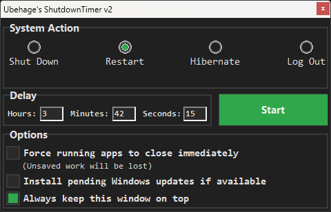

# ShutdownTimer v2

A simple, lightweight, and **100% portable** shutdown timer for Windows.  
Schedule your PC to shut down, restart, hibernate, or log out after a custom delay.

---

## Features

- **System Actions:** Shut down, restart, hibernate, or log out with a single click.
- **Custom Delay:** Specify hours, minutes, and seconds before the action occurs.
- **Force Close Apps:** Optionally force running apps to close immediately (unsaved work will be lost).
- **Windows Updates:** Optionally install pending Windows updates during shutdown (if available).
- **Stay on Top:** Keep the ShutdownTimer window always visible.
- **Portable:** No installation required. Preferences are saved in the Windows registry for your convenience, but no other changes are made to your PC.

---

## Screenshots

### Main Window

### Countdown in Progress

---

## Usage

1. **Select a System Action:**  
   - Shut Down, Restart, Hibernate, or Log Out.

2. **Set the Delay:**  
   - Enter the desired hours, minutes, and seconds.

3. **Choose Your Options (optional):**
   - **Force running apps to close immediately:**  
     If enabled, all running applications are closed without prompting to save work.
   - **Install pending Windows updates if available:**  
     If enabled, Windows will attempt to install any pending updates during shutdown.
   - **Always keep this window on top:**  
     Keeps the ShutdownTimer in the foreground.

4. **Click Start:**  
   - The timer begins counting down and will perform the selected action when time runs out.
   - The countdown and a progress bar will be shown. You can cancel at any time with the Stop button.

---

## Portability

- **No installation required.**
- **No files are written to your system except for registry keys** (for storing your preferences).
- Can be run from USB drives, cloud folders, or any folder on your PC.

---

## Notes

- **Force closing apps may result in loss of unsaved work.** Use this option with caution.
- The program cannot always detect if Windows updates are pending, but will instruct Windows to install them if selected.
- Works on Windows 7, 8, 8.1, 10, and 11.

---

## License

[MIT License](LICENSE)  
Copyright © Ubehage

---

## Credits

Created by Ubehage  
[GitHub Profile](https://github.com/Ubehage)
